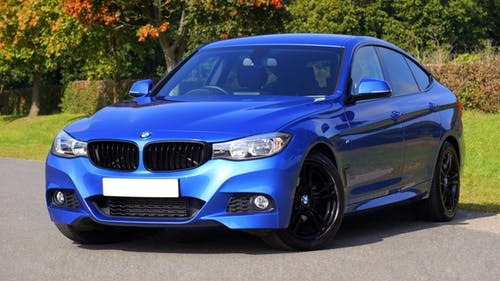
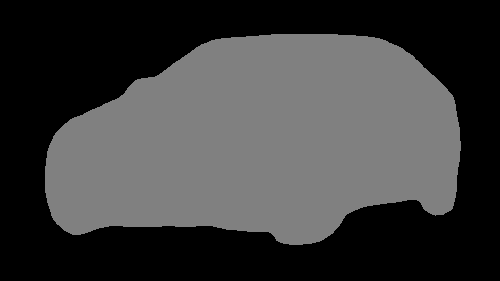

# AutonomousCar

Here we are trying to use the famous technique called Semantic Segmentation. I have alredy trained the model using Fully Conneted
Convolution Network on Pascal VOC dataset which you can download from cityscapes official website.

Here is the input image given to modal 

and here is the result 

since the size of the trained model is >100MB i have not uploaded.

